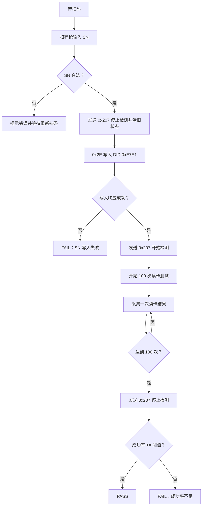

# 美团协议产线检测 Tab 实现设计方案

## 1. 需求目标

在美团协议模式下新增一个“产线检测”Tab，用于产线操作员完成终端 SN 写入和 RFID 读卡成功率检测的一体化流程。

核心目标：

- 扫码枪扫描终端 SN 后自动填入并自动开始检测。
- 校验 SN 合法后自动写入终端非易失存储区。
- SN 写入成功后自动执行 100 次读卡成功率测试。
- 根据可配置成功率阈值判定 PASS / FAIL。
- 流程状态、统计数据、失败原因清晰展示，降低产线误操作成本。
- 产线操作员原则上只需要“扫码”和“换下一台”，不需要频繁点击按钮。

## 2. 已确认规则

### 2.1 SN 规则

- SN 固定 16 位。
- SN 前 6 位必须为 `R2A3A0`。
- SN 仅允许 ASCII 字符。
- 建议进一步限制为大写字母和数字：`[A-Z0-9]{16}`。
- SN 写入 DID 为 `0xE7E1`。
- 数据类型为 `char[16]`。
- 写入数据为 SN 的 ASCII 字节，不追加 `\0`，不做填充。

示例：

```text
SN: R2A3A02625000001
DID: 0xE7E1
DATA HEX: 52 32 41 33 41 30 32 36 32 35 30 30 30 30 30 31
```

### 2.2 读卡测试规则

- 固定测试 100 次。
- 测试期间不主动设置扫描周期，保持设备出厂设置。
- 成功一次的标准：识别到任意有效 TAG 即算成功。
- 成功率阈值可配置，例如默认 `95%`。
- 判定规则：

```text
成功率 >= 阈值 => PASS
成功率 < 阈值  => FAIL
```

## 3. 功能范围

### 3.1 本次新增

- 新增美团协议“产线检测”Tab。
- 新增 SN 输入与合法性校验。
- 接入现有美团 `0x2E` 写非易失存储区能力。
- 新增产线检测流程状态机。
- 新增 100 次读卡统计。
- 新增 PASS / FAIL 结果展示。
- 新增运行日志与失败原因提示。

### 3.2 不修改范围

- 不修改青桔协议。
- 不修改 BB / FF / 哈啰 RS485 协议。
- 不修改 CAN 底层收发接口。
- 不修改 OTA 逻辑。
- 不主动修改 RFID 扫描周期配置。
- 不引入数据库。

## 4. UI 设计

### 4.1 Tab 入口

在现有 RFID 面板 `QTabWidget` 中新增 Tab：

```text
产线检测
```

仅美团协议模式下启用。

当协议切换到青桔、BB、FF、哈啰等模式时：

- 产线检测 Tab 可隐藏或禁用。
- 若产线检测正在运行，应提示用户先停止检测。

### 4.2 页面布局建议

页面分为 4 个区域：

1. SN 写入区
2. 测试配置区
3. 运行状态区
4. 过程日志区

#### SN 写入区

控件：

| 控件 | 类型 | 说明 |
| --- | --- | --- |
| SN 输入框 | `QLineEdit` | 支持扫码枪输入，监听扫码完成事件并自动开始 |
| 开始检测按钮 | `QPushButton` | 备用手动触发入口，默认不依赖工人点击 |
| 停止按钮 | `QPushButton` | 异常情况下中止当前流程 |
| 清空/下一台按钮 | `QPushButton` | 清空当前结果，准备下一台，也可自动完成 |

SN 输入框行为：

- 页面进入产线检测 Tab 后自动聚焦 SN 输入框。
- 扫码枪输入后通常会发送回车，触发 `returnPressed` 后自动执行 SN 校验。
- 若扫码枪不发送回车，也应支持“输入稳定 150~300ms 后自动识别完整 SN”的兜底策略。
- 校验通过后自动开始检测流程，不要求操作员点击“开始检测”。
- 校验失败时输入框标红并提示原因。
- 检测运行中应锁定 SN 输入框，避免二次扫码覆盖当前流程。
- PASS / FAIL 后重新放开 SN 输入框并自动全选，方便下一次扫码直接覆盖。

#### 测试配置区

控件：

| 控件 | 类型 | 默认值 | 说明 |
| --- | --- | --- | --- |
| 测试次数 | `QSpinBox` 或固定标签 | 100 | 建议首版固定 100，减少误操作 |
| 通过阈值 | `QDoubleSpinBox` 或 `QSpinBox` | 95% | 支持配置成功率大于等于多少为通过 |

建议：

- 测试次数首版固定为 `100`，UI 只显示不可编辑标签。
- 成功率阈值可编辑，范围 `0~100`，步进 `1`。

#### 运行状态区

显示字段：

| 字段 | 示例 |
| --- | --- |
| 当前状态 | 待扫码 / 校验SN / 写入SN / 等待写入响应 / 读卡测试中 / PASS / FAIL / 已停止 |
| 当前 SN | `R2A3A02625000001` |
| 写入状态 | 未写入 / 写入中 / 写入成功 / 写入失败 |
| 测试进度 | `37 / 100` |
| 成功次数 | `35` |
| 失败次数 | `2` |
| 成功率 | `94.59%` |
| 当前 TAG | 最近一次识别到的 TAG |
| 最后失败原因 | 超时 / 未识别到 TAG / 模块故障 / 通信异常 |
| 最终结果 | PASS / FAIL |

颜色建议：

- 待机/未启动：灰色
- 运行中：蓝色或橙色
- PASS：绿色
- FAIL：红色

#### 过程日志区

建议使用 `QPlainTextEdit` 或 `QTextEdit` 只读展示。

日志示例：

```text
[14:20:01.123] 扫码输入 SN=R2A3A02625000001
[14:20:01.130] SN 校验通过
[14:20:01.132] 停止 RFID 扫描并清空旧 TAG 状态
[14:20:01.135] 开始写入 DID=0xE7E1 DATA=52 32 ...
[14:20:01.480] SN 写入成功
[14:20:01.490] 发送 0x207 开始检测
[14:20:01.500] 开始读卡测试 100 次，阈值 95%
[14:20:01.620] #001 PASS TAG=...
[14:20:01.740] #002 FAIL 未识别到 TAG
[14:20:13.880] 发送 0x207 停止检测
[14:20:13.900] 检测完成 成功率=97.00% 结果=PASS
```

## 5. 流程设计

### 5.1 总体流程



### 5.2 SN 输入与自动开始

触发方式：

- 首选：扫码枪输入并回车，自动开始检测。
- 兜底：扫码枪输入后没有回车，但内容稳定一段时间且满足 SN 格式，自动开始检测。
- 备用：用户点击“开始检测”。

处理步骤：

1. 读取 SN 输入框内容。
2. 去除首尾空白、`\r`、`\n`、`\t`。
3. 转大写，或要求输入本身必须大写。
4. 校验长度为 16。
5. 校验前 6 位为 `R2A3A0`。
6. 校验字符集为 `[A-Z0-9]`。
7. CAN 未启动时提示先启动 CAN。
8. 当前已有产线检测、压测、OTA、0x2E 写入进行中时禁止开始。
9. 进入 SN 写入流程。

### 5.3 扫码输入与焦点策略

产线使用扫码枪时，不能完全依赖操作员手动把光标点到 SN 输入框。建议增加专门的扫码捕获策略。

#### 5.3.1 默认聚焦

- 进入“产线检测”Tab 时，自动调用 `snEdit->setFocus()`。
- 每次 PASS / FAIL / 停止 / 清空后，自动将焦点恢复到 SN 输入框。
- 恢复焦点时同时执行 `selectAll()`，下一次扫码会直接覆盖旧 SN。
- 主窗口重新激活时，如果当前停留在产线检测 Tab 且流程未运行，也自动恢复 SN 输入框焦点。

#### 5.3.2 防止光标位置导致拼接旧内容

常见风险：

- 输入框内残留上一台 SN。
- 光标停在中间位置。
- 扫码后新 SN 被插入到旧 SN 中间。
- 操作员手动点击了其他控件，扫码输入没有进入 SN 框。

建议处理：

- 待扫码状态下，SN 输入框始终保持全选。
- 检测结束后不保留可编辑旧 SN，旧 SN 只显示在结果区。
- SN 输入框只作为“下一台扫码缓冲区”，不是结果记录区。
- 当检测结束进入待扫码状态时：

```text
snEdit->clear();
snEdit->setFocus();
```

- 如果希望保留上一台 SN 方便追溯，应显示在“当前/上一台 SN”标签中，不放在可编辑输入框里。

#### 5.3.3 全局扫码捕获兜底

建议在产线检测 Tab 激活且流程未运行时，增加全局键盘事件过滤器：

- 捕获快速连续键盘输入。
- 识别扫码枪特征：
  - 字符间隔很短，例如小于 30ms。
  - 以 Enter 结束，或累计长度达到 16。
  - 内容满足 `R2A3A0[A-Z0-9]{10}`。
- 即使焦点在阈值 SpinBox、日志框或其他控件上，也能把扫码内容送入 SN 检测流程。

不建议全局事件过滤器在以下状态工作：

- 正在产线检测。
- 正在 OTA。
- 正在普通压测。
- 当前不是美团协议。
- 当前不在产线检测 Tab。

#### 5.3.4 扫码完成判定

支持两种完成信号：

1. 回车结束：

```text
扫码内容 + Enter
```

2. 定时稳定：

```text
输入长度达到 16 且 200ms 内无新增字符
```

推荐参数：

| 参数 | 建议值 |
| --- | --- |
| 字符间隔识别阈值 | 30ms |
| 无回车稳定等待 | 200ms |
| 最小扫码长度 | 16 |
| 最大缓存长度 | 32 |

#### 5.3.5 误扫与重复扫码处理

| 场景 | 处理建议 |
| --- | --- |
| 待扫码时扫入合法 SN | 自动开始检测 |
| 待扫码时扫入非法 SN | 红色提示并蜂鸣，不开始 |
| 检测运行中再次扫码 | 忽略并提示“检测中，请等待结果” |
| PASS/FAIL 后扫码下一台 | 自动清空上一轮临时状态并开始下一轮 |
| 短时间重复扫同一 SN | 若上一轮仍在运行则忽略；若上一轮已结束，可允许重新检测但记录“重复 SN”提示 |
| 扫码内容包含前后缀 | 可配置是否自动截取 `R2A3A0[A-Z0-9]{10}` |

首版建议：

- 不自动截取前后缀，严格要求扫码内容就是 16 位 SN。
- 如果现场扫码枪配置带前后缀，再增加可配置截取规则。

### 5.4 SN 写入

复用现有 `RfidDiagnosticTransfer`：

```cpp
rfidDiagnosticTransfer.startWriteNonVolatile(0xE7E1, snBytes);
```

写入帧行为：

- SN 16 字节。
- `0x2E + DID(2) + SN(16)` 总载荷 19 字节。
- 超过 ISO-TP 单帧能力，自动走多帧：
  - 首帧 FF
  - 等待 0x107 流控帧 FC
  - 连续帧 CF
  - 等待最终 `0x6E E7 E1` 肯定响应

写入成功条件：

- 收到 `0x6E` 肯定响应。
- 响应 DID 为 `0xE7E1`。

写入失败条件：

- 收到 `0x7F 2E NRC`。
- FC 超时。
- 最终响应超时。
- DID 不匹配。
- CAN 发送失败。
- 用户停止流程。

写入前准备：

- 若当前 `rfidScanning == true`，先发送一次 `0x207 停止检测`。
- 将 `rfidScanning` 置为 false。
- 清空 `RfidService` 中旧 TAG、旧状态和旧响应缓存。
- 清空产线服务中的 `lastValidTag`。
- 写入阶段不启动 100 次读卡统计。

这样可以避免上一台设备或写入前的 TAG 上报混入本次产线测试。

### 5.5 读卡测试启动

SN 写入成功后自动启动读卡测试。

启动动作：

- 设置产线检测状态为 `读卡测试中`。
- 清零统计数据。
- 设置目标次数为 100。
- 保持设备出厂扫描周期，不发送 `0x29` 改周期。
- 在收到 `0x6E E7 E1` 写入成功响应后，再开启 RFID 扫描控制：
  - `rfidScanning = true`
  - 发送一次 `0x207` 开始检测帧
  - 若当前启用了周期控制定时器，则继续按现有逻辑发送 `0x207`
- 从发送 `0x207` 开始检测之后，再开始等待并统计读卡结果。

注意：

- 产线检测期间不应改变用户配置的 `0x2C0` 周期。
- 如果当前设备出厂周期较慢，检测耗时随设备周期自然变长。
- 若 SN 写入失败，不发送 `0x207` 开始检测，直接进入 FAIL。

### 5.6 读卡测试结束

测试达到 100 次或用户停止时：

- 发送一次 `0x207` 停止检测帧。
- 将 `rfidScanning` 置为 false。
- 停止产线服务内部采样计时器。
- 锁定本轮结果，显示 PASS / FAIL / STOPPED。
- 准备下一台扫码输入。

若普通 RFID 控制定时器仍开启，应确认其后续发送内容为停止检测状态，避免测试结束后设备继续扫描。

### 5.7 单次读卡采样

建议以美团 `0x2C0` 状态帧作为一次采样边界。

一次采样判定：

- 收到 `0x2C0` 状态帧后，读取解析结果。
- 若 `cardStatus == 识别到 TAG` 且当前 TAG 非空，则本次 PASS。
- 若 `cardStatus == 未识别到 TAG`，本次 FAIL。
- 若 `cardStatus == TAG 长度异常`，本次 FAIL。
- 若 `faultStatus != 无故障`，本次 FAIL。

成功标准：

```text
识别到任意有效 TAG 即成功。
```

不要求 TAG 与 SN 或指定测试卡绑定。

### 5.8 TAG 分片时序处理

美团协议 TAG 可能通过 `0x2C1`、`0x2C2`、`0x2C6` 分片上报，`0x2C0` 状态帧和 TAG 分片到达顺序可能不完全固定。

建议实现时保守处理：

- 维护最近一次完整 TAG。
- 当收到 TAG 分片并拼出非空 TAG 时更新 `lastValidTag`。
- 收到 `0x2C0` 且卡状态为“识别到 TAG”时：
  - 若 `lastValidTag` 非空，则判定 PASS。
  - 若 `lastValidTag` 暂为空，可等待一个短暂窗口，例如 200ms，等待 TAG 分片补齐。
  - 超过窗口仍无 TAG，则判定 FAIL，原因：`识别状态有效但 TAG 未拼齐`。

首版简化方案：

- 以现有 `RfidService::state().tag` 为准。
- 若状态帧显示识别到 TAG 但 `tag` 为空，则本次暂不计数，等待后续 TAG 分片。
- 设置单次采样最大等待时间，例如 1000ms，超时计 FAIL。

### 5.9 `0x207` 控制信息广播策略

产线检测应将 `0x207` 控制帧作为明确的阶段边界，而不是从扫码开始就持续扫描。

推荐策略：

| 阶段 | `0x207` 行为 | 目的 |
| --- | --- | --- |
| 待扫码 | 保持停止或现有空闲状态 | 等待下一台，不产生无关读卡数据 |
| SN 校验通过后 | 发送一次停止检测 | 清理写入前扫描状态 |
| SN 写入中 | 不发送开始检测 | 避免读卡上报干扰写入流程和统计边界 |
| SN 写入成功后 | 发送开始检测 | 从此刻开始进入 100 次读卡统计 |
| SN 写入失败 | 不发送开始检测 | 直接 FAIL |
| 读卡测试中 | 保持开始检测状态 | 正常收集读卡结果 |
| 测试完成 | 发送停止检测 | 结束本轮，准备下一台 |
| 用户停止 | 发送停止检测 | 避免设备继续扫描 |

实现建议：

- 产线检测接管 `rfidScanning` 状态。
- 写入前执行：

```text
rfidScanning = false
sendRfidFrame(0x207, buildControlFrame(false))
```

- 写入成功后执行：

```text
rfidScanning = true
sendRfidFrame(0x207, buildControlFrame(true))
```

- 测试完成或中止时执行：

```text
rfidScanning = false
sendRfidFrame(0x207, buildControlFrame(false))
```

注意：

- 如果普通 RFID 控制定时器开启，它会继续按 `rfidScanning` 的当前值发送 `0x207`，因此只要维护好 `rfidScanning` 即可。
- 产线检测运行时应禁用普通“开始检测/停止检测”按钮，避免人工改变 `rfidScanning`。
- 开始统计前应丢弃所有早于“写入成功后 0x207 开始检测”的 RFID 状态和 TAG 缓存。

## 6. 状态机设计

建议新增独立状态机，避免把产线流程散落在 `MainWindow`。

### 6.1 状态定义

```text
Idle
ValidatingSn
WritingSn
WaitingWriteResponse
TestingCard
Passed
Failed
Stopped
```

### 6.2 状态含义

| 状态 | 含义 |
| --- | --- |
| `Idle` | 等待扫码 |
| `ValidatingSn` | 正在校验 SN |
| `WritingSn` | 已发起 0x2E 写入 |
| `WaitingWriteResponse` | 等待 0x6E/0x7F 响应 |
| `TestingCard` | 正在执行 100 次读卡 |
| `Passed` | 检测通过 |
| `Failed` | 检测失败 |
| `Stopped` | 用户停止或协议切换中止 |

### 6.3 推荐类设计

建议新增应用层服务：

```text
CAN_RFID_Qt/application/productiontestservice.h
CAN_RFID_Qt/application/productiontestservice.cpp
```

建议职责：

- 保存产线检测状态。
- 校验 SN。
- 管理 100 次读卡统计。
- 接收 SN 写入结果。
- 接收美团 RFID 状态更新。
- 输出 UI 需要的状态模型。

不建议把完整产线状态机全部写在 `MainWindow` 中，否则后续维护和测试会变困难。

### 6.4 服务接口草案

```cpp
struct ProductionTestConfig
{
    int totalSamples = 100;
    double passRateThreshold = 95.0;
};

struct ProductionTestState
{
    bool running = false;
    QString phaseText;
    QString sn;
    int totalSamples = 100;
    int completedSamples = 0;
    int successCount = 0;
    int failureCount = 0;
    double successRate = 0.0;
    QString currentTag;
    QString lastFailureReason;
    QString resultText;
};
```

核心方法：

```cpp
bool start(const QString &sn, const ProductionTestConfig &config, QString *error);
void stop(const QString &reason);
void handleWriteFinished(bool success, const QString &message);
void handleRfidState(const RfidState &state);
ProductionTestState state() const;
```

信号：

```cpp
void writeSnRequested(quint16 did, const QByteArray &data);
void scanControlRequested(bool enabled);
void stateChanged(const ProductionTestState &state);
void logMessage(const QString &message);
void finished(bool passed, const ProductionTestState &state);
```

### 6.5 扫码捕获辅助类

建议把扫码枪输入识别从 `ProductionTestService` 中拆出来，避免键盘事件处理污染业务状态机。

可新增轻量辅助对象：

```text
CAN_RFID_Qt/application/scaninputbuffer.h
CAN_RFID_Qt/application/scaninputbuffer.cpp
```

职责：

- 接收来自 SN 输入框或全局事件过滤器的字符。
- 根据字符间隔、Enter、长度和稳定等待判断一次扫码完成。
- 输出候选 SN 字符串。
- 不负责 SN 业务合法性判断。

接口草案：

```cpp
class ScanInputBuffer : public QObject
{
    Q_OBJECT
public:
    explicit ScanInputBuffer(QObject *parent = nullptr);

    void reset();
    void appendCharacter(QChar ch);
    void finishByEnter();
    void setEnabled(bool enabled);

signals:
    void scanCompleted(const QString &text);
};
```

配置建议：

```cpp
struct ScanInputConfig
{
    int stableTimeoutMs = 200;
    int maxInterKeyIntervalMs = 30;
    int minLength = 16;
    int maxLength = 32;
};
```

使用方式：

- `QLineEdit::returnPressed` 直接触发一次完成。
- `eventFilter` 捕获键盘输入后送入 `ScanInputBuffer`。
- `ScanInputBuffer::scanCompleted` 触发 `startProductionTestFromSn(scanText)`。

## 7. 与现有模块集成

### 7.1 复用模块

| 模块 | 复用内容 |
| --- | --- |
| `RfidDiagnosticTransfer` | SN 写入 `0x2E DID=0xE7E1` |
| `RfidService` | 美团 RFID 状态、TAG、故障状态解析 |
| `MainWindow::sendRfidFrame()` | CAN 帧发送 |
| `LogService` | 运行日志记录 |

### 7.2 MainWindow 接入点

建议新增：

- `QWidget *createProductionTestTab(QWidget *parent);`
- `void updateProductionTestPanel(const ProductionTestState &state);`
- `void appendProductionTestLog(const QString &message);`
- `void startProductionTestFromSnInput();`
- `void startProductionTestFromSn(const QString &sn);`
- `void prepareProductionSnInput();`
- `void stopProductionTest();`
- `bool eventFilter(QObject *watched, QEvent *event);` 或单独在产线 Tab 控件上安装事件过滤器。

在 `setupRfidPanel()` 中新增 Tab：

```cpp
QWidget *productionTestTab = createProductionTestTab(rfidTabs);
rfidTabs->addTab(productionTestTab, QStringLiteral("产线检测"));
```

在 `updateRfidPanel()` 后，将最新状态传给产线服务：

```cpp
productionTestService.handleRfidState(state);
```

在 `RfidDiagnosticTransfer::finished` 回调中，如果当前处于产线写 SN 阶段，将写入结果转交产线服务：

```cpp
productionTestService.handleWriteFinished(success, message);
```

### 7.3 写入结果归属问题

当前 `RfidDiagnosticTransfer` 是通用 0x2E 写入通道，既会被手动写入使用，也会被产线检测使用。

为避免产线流程误接收手动写入结果，建议新增“调用来源”或由 `ProductionTestService` 维护写入中标志：

方案 A：MainWindow 侧维护 `productionWritePending`

- 产线开始写 SN 前置为 true。
- `RfidDiagnosticTransfer::finished` 到来时：
  - 若 `productionWritePending == true`，交给产线服务。
  - 同时置 false。
  - 仍按现有逻辑记录日志。

方案 B：扩展 `RfidDiagnosticTransfer` 支持上下文 ID

- `startWriteNonVolatile(did, data, context)`
- `finished(success, message, context)`

首版建议方案 A，改动较小。

## 8. 并发与互斥

产线检测运行时应禁止以下操作：

- 普通压力测试启动。
- OTA 升级启动。
- 手动 0x2E 写入。
- 0x2E 快捷写入。
- 普通 RFID 开始检测 / 停止检测。
- 协议模式切换。
- 关闭 CAN。

如果用户强制停止或切换协议：

- 弹窗确认。
- 发送 `0x207` 停止检测。
- 中止产线检测。
- 停止测试计数。
- 保留当前日志和失败原因。

互斥检查建议集中在 `updateControlsState()`。

## 9. 产线合理化设计

### 9.1 操作节拍

目标操作节拍：

```text
放置设备 -> 扫 SN -> 自动写入 -> 自动读卡 100 次 -> 显示 PASS/FAIL -> 换下一台 -> 扫下一台 SN
```

操作员不需要频繁点击“开始检测”。

建议行为：

- 页面常驻“产线检测”Tab。
- SN 输入框始终准备接收下一次扫码。
- 合法 SN 扫入后立即自动开始。
- 检测中锁定配置项，避免中途改阈值。
- PASS/FAIL 后显示大号结果，保持到下一次扫码。
- 下一次扫码自动清理上一轮临时统计，不要求先点“清空”。

### 9.2 大号结果与声光提示

产线现场通常环境嘈杂，结果提示必须醒目。

建议：

- 页面中央或顶部显示大号结果：
  - `PASS`：绿色背景，白色大字。
  - `FAIL`：红色背景，白色大字。
  - `RUNNING`：蓝色或橙色背景。
- 可选蜂鸣：
  - PASS：短响 1 次。
  - FAIL：短响 3 次。
- 若不希望声音干扰，可增加“声音提示”开关，默认开启或由配置决定。

### 9.3 下一台自动准备

检测完成后：

- 保留最终结果和上一台 SN。
- 清空 SN 输入框。
- 输入框自动聚焦。
- 输入框保持空白，不让旧 SN 残留在可编辑区域。
- 下一次扫入合法 SN 后自动开始新流程。

建议保留字段：

| 字段 | 说明 |
| --- | --- |
| 上一台 SN | 最近完成检测的 SN |
| 上一台结果 | PASS / FAIL |
| 上一台成功率 | 例如 97.00% |
| 上一台完成时间 | 便于追溯 |

### 9.4 失败后的处理策略

FAIL 后不应自动重测同一台，避免掩盖真实问题。

建议：

- FAIL 后进入结果锁定状态。
- 操作员可以：
  - 扫下一台 SN，自动开始下一台。
  - 点击“重新检测当前 SN”，对当前 SN 再测一次。
  - 点击“停止/清空”，回到待扫码。
- 重新检测当前 SN 应记录日志：

```text
当前 SN 执行重新检测
```

首版可以先不做“重新检测当前 SN”按钮，只允许扫下一台或清空。

### 9.5 防止重复 SN 和漏测

首版建议在内存中保存最近若干条检测记录，例如最近 100 条。

如果扫入 SN 与最近记录重复：

- 若上一轮同 SN 正在运行：忽略并提示。
- 若上一轮同 SN 已 PASS：提示“该 SN 最近已通过，是否重新检测？”
- 若上一轮同 SN 已 FAIL：提示“该 SN 最近失败，是否重新检测？”

产线如果后续需要强追溯，应扩展为 CSV 或数据库记录。

### 9.6 配置防误操作

生产参数不应被操作员频繁修改。

建议：

- 成功率阈值默认 `95%`。
- 阈值修改需要管理员模式，或至少弹窗确认。
- 测试次数固定 `100`，首版不开放修改。
- SN 前缀固定 `R2A3A0`，首版不开放修改。

如果必须开放配置，建议放到“高级设置”折叠区，避免产线误触。

### 9.7 异常恢复

常见异常和建议处理：

| 异常 | 处理 |
| --- | --- |
| CAN 未启动 | 页面顶部红色提示，禁止扫码自动开始 |
| 设备离线 | 检测中则 FAIL，待扫码时提示离线 |
| SN 写入超时 | FAIL，显示写入失败原因 |
| 读卡长时间无状态帧 | FAIL，原因 `状态帧超时` |
| 操作员拔掉 CAN 设备 | 中止流程，结果为 Stopped，不判 PASS |
| 协议被切换 | 若检测中，弹窗确认后中止 |

### 9.8 数据留存建议

首版至少在界面日志和运行日志中记录。

推荐增加“自动保存检测结果 CSV”配置，方便产线追溯。

记录字段建议：

| 字段 | 说明 |
| --- | --- |
| startTime | 检测开始时间 |
| finishTime | 检测结束时间 |
| sn | 终端 SN |
| writeResult | SN 写入结果 |
| testResult | PASS / FAIL / STOPPED |
| successRate | 成功率 |
| successCount | 成功次数 |
| failureCount | 失败次数 |
| threshold | 阈值 |
| lastTag | 最后识别 TAG |
| failureReason | 失败原因 |

### 9.9 与扫码枪配置配合

建议产线扫码枪配置：

- 输出原始 SN 字符串。
- 扫码后追加 Enter。
- 不追加 Tab。
- 不追加特殊前缀/后缀。
- 使用英文输入模式。

软件仍需做兜底：

- 清理 `\r\n\t`。
- 自动转大写或拒绝小写。
- 若包含不可见字符，提示明确错误。

## 10. 错误处理

### 10.1 SN 校验失败

提示示例：

| 场景 | 提示 |
| --- | --- |
| 为空 | `SN不能为空` |
| 长度不是16 | `SN必须为16位` |
| 前缀错误 | `SN前6位必须为R2A3A0` |
| 非法字符 | `SN仅支持大写字母和数字` |

### 10.2 写入失败

提示示例：

```text
SN写入失败：等待 0x2E 写入响应超时
SN写入失败：NRC=0x31 请求超出范围
SN写入失败：响应 DID 不匹配
```

### 10.3 读卡失败原因

建议统计最后失败原因：

- 未识别到 TAG
- TAG 长度异常
- RFID 模块故障
- RFID 通信异常
- 状态帧超时
- TAG 分片未拼齐

## 11. 统计计算

### 11.1 计数规则

```text
completedSamples = successCount + failureCount
successRate = successCount * 100.0 / completedSamples
```

检测完成时：

```text
completedSamples == 100
```

最终成功率：

```text
finalSuccessRate = successCount * 100.0 / 100
```

### 11.2 结果判定

```cpp
passed = finalSuccessRate >= passRateThreshold;
```

显示建议：

```text
PASS  成功率 97.00%  阈值 95.00%
FAIL  成功率 92.00%  阈值 95.00%
```

## 12. 日志与追溯

首版建议仅显示在界面过程日志，并写入运行日志。

后续可扩展：

- 自动保存 CSV。
- 保存字段：
  - 时间
  - SN
  - 结果
  - 成功率
  - 成功次数
  - 失败次数
  - 阈值
  - 最后 TAG
  - 失败原因

CSV 示例：

```csv
time,sn,result,successRate,successCount,failureCount,threshold,lastTag,lastFailureReason
2026-06-22 15:20:01,R2A3A02625000001,PASS,97.00,97,3,95.00,E200...,未识别到 TAG
```

## 13. 测试方案

### 13.1 单元/静态验证

- SN 为空。
- SN 长度不足。
- SN 长度超过 16。
- SN 前缀不是 `R2A3A0`。
- SN 包含小写字母。
- SN 包含中文。
- SN 包含空格。
- 合法 SN：`R2A3A02625000001`。

### 13.2 模拟流程验证

- 写入成功后自动进入读卡测试。
- 写入失败后直接 FAIL，不进入读卡测试。
- SN 写入前会先发送 `0x207` 停止检测。
- SN 写入中不会发送 `0x207` 开始检测。
- 收到 `0x6E E7 E1` 后才发送 `0x207` 开始检测。
- 发送 `0x207` 开始检测后才开始计入 100 次读卡统计。
- 测试完成后会发送 `0x207` 停止检测。
- 100 次全部成功，结果 PASS。
- 100 次全部失败，结果 FAIL。
- 成功率等于阈值，结果 PASS。
- 成功率低于阈值，结果 FAIL。
- 用户中途点击停止，流程进入 Stopped。
- 扫码枪回车触发后自动开始检测，不点击按钮。
- 扫码枪不带回车时，输入 16 位合法 SN 后通过稳定等待自动开始。
- 光标在 SN 输入框中间时，下一次扫码不会拼接旧 SN。
- 光标在阈值控件或日志控件上时，全局扫码捕获仍能识别 SN。
- 检测运行中再次扫码不会覆盖当前 SN。
- PASS / FAIL 后扫码下一台 SN 可自动开始新流程。
- 最近一次已 PASS 的 SN 重复扫码时有明确提示。

### 13.3 实机验证

- 扫码枪输入是否能触发回车自动开始。
- 扫码枪不在输入框聚焦时是否仍可触发自动开始。
- PASS / FAIL 后输入框是否自动清空、聚焦并准备下一台。
- 合法 SN 是否能写入并收到 `0x6E E7 E1`。
- 抓 CAN 日志确认写入成功前没有发送 `0x207` 开始检测。
- 抓 CAN 日志确认写入成功后才发送 `0x207` 开始检测。
- 抓 CAN 日志确认测试完成或停止时发送 `0x207` 停止检测。
- 读卡 100 次是否按出厂周期自然执行。
- 放置标准测试卡时成功率是否符合预期。
- 移走测试卡时失败次数是否增加。
- RFID 模块故障或通信异常时是否 FAIL。

## 14. 风险与注意事项

- 没有读 DID 服务时，SN 写入只能依赖 `0x6E E7 E1` 响应确认，无法独立读回校验。
- 如果设备出厂扫描周期较长，100 次测试耗时会较长。
- 如果 TAG 分片和状态帧到达顺序不稳定，需要增加短暂等待窗口，避免误判。
- 产线检测和普通压测都依赖 RFID 状态帧，应避免同时运行。
- 扫码枪可能带前后缀或回车，需要在输入层清理不可见字符。

## 15. 推荐实施步骤

1. 新增 `ProductionTestService`，实现 SN 校验、流程状态机和统计逻辑。
2. 新增“产线检测”Tab UI。
3. 将扫码输入和开始按钮接入产线服务。
4. 将产线 SN 写入接入 `RfidDiagnosticTransfer`。
5. 将 `RfidService` 状态更新转发给产线服务。
6. 补充互斥控制，运行中禁用压测、OTA、手动写入和协议切换。
7. Release 构建。
8. 使用扫码枪和实物 RFID 模块做实机验证。

## 16. 建议默认参数

| 参数 | 默认值 |
| --- | --- |
| SN 前缀 | `R2A3A0` |
| SN 长度 | 16 |
| SN 字符集 | `[A-Z0-9]` |
| 写入 DID | `0xE7E1` |
| 测试次数 | 100 |
| 通过阈值 | 95% |
| 单次采样超时 | 1000ms |
| TAG 分片等待窗口 | 200ms |
